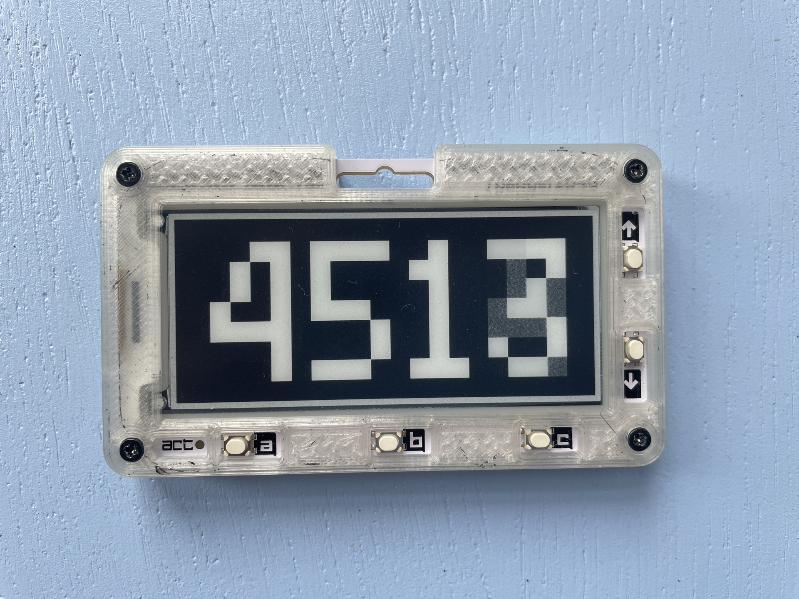

# badger2040-simple-counter

I added a simple counter program to the examples library of the badger 2040. 
Since im not a programmer please correct me on my mistakes. 

In order to run the program you need to copy the counter.json file to the /state directory and the files counter.py and icon-coounter.jpg to the /examples directory of the badger OS via Thonny.

**Button Mapping:**

Up: count up by one

Down: count down by one

a + Up or Down: count up or down by 1000

b + Up or Down: count up or down by 100

c + Up or Down: count up or down by 10

Up + Down: reset the counter to 0

press a + b to return to the launcher

